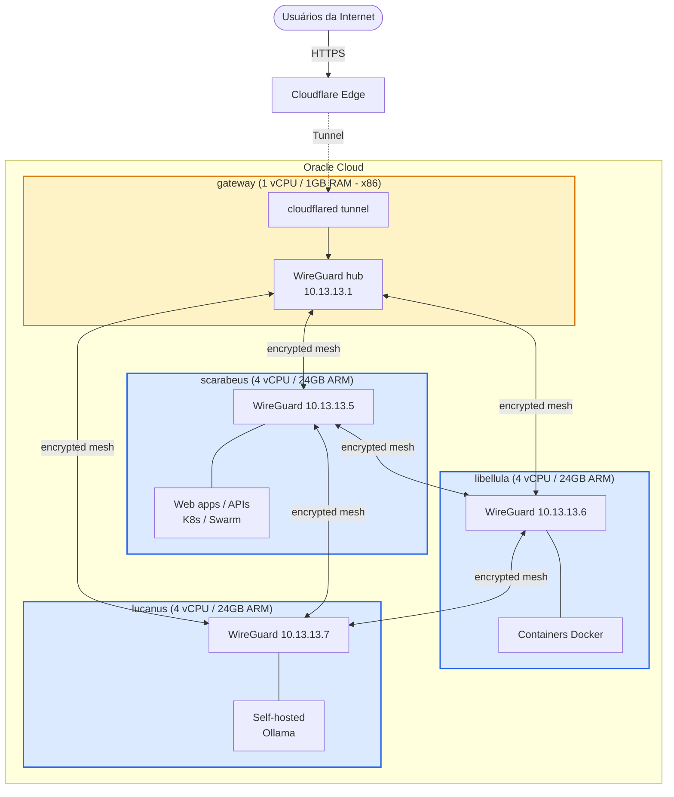

# infra-lab

Laboratório pessoal de infraestrutura na nuvem rodando no Oracle Cloud Free Tier. O projeto documenta e operacionaliza um ambiente VPS com 4 nodes, utilizado para self-hosted services, experimentação contínua e aprendizado prático em DevOps, redes e platform engineering.

> **Status:** Documento vivo. O laboratório evolui conforme estudo novos tópicos — security hardening, CI/CD, observabilidade e IaC estão sendo adicionados progressivamente.

## Visão geral

O modelo arquitetural segue três princípios fundamentais: **zero exposed ports** (nenhuma VM tem HTTP/HTTPS público; todo ingress flui pelo Cloudflare Tunnel), **private mesh by default** (comunicação entre nodes via WireGuard em criptografia de ponta a ponta) e **custo zero** (totalmente dentro do Always Free da OCI).



## Inventário

| Host | Papel | Specs | Arquitetura |
|------|-------|-------|-------------|
| `gateway` | Hub WireGuard + Cloudflare Tunnel | 1 vCPU / 1 GB | x86_64 (E2.1.Micro) |
| `scarabeus` | Web apps, APIs, K8s/Swarm | 4 vCPU / 24 GB | ARM64 (A1.Flex) |
| `libellula` | Containers Docker | 4 vCPU / 24 GB | ARM64 (A1.Flex) |
| `lucanus` | Self-hosted services (Ollama) | 4 vCPU / 24 GB | ARM64 (A1.Flex) |

> As atribuições de papel são ilustrativas. O laboratório é intencionalmente flexível para experimentos com k3s, Swarm, e outras topologias de orquestração.

## Estrutura do repositório

```
infra-lab/
├── README.md                    ← Este arquivo
├── CHANGELOG.md
├── AGENTS.md
├── .gitignore
├── docs/
│   ├── architecture.md
│   ├── network.md
│   ├── runbook.md
│   └── diagrams/
│       └── overview.mmd
├── adr/
│   ├── README.md
│   ├── template.md
│   ├── 0001-oracle-cloud-free-tier.md
│   ├── 0002-gateway-node-separado.md
│   ├── 0003-arm-ampere-como-arquitetura-primaria.md
│   ├── 0004-cloudflare-tunnel.md
│   └── 0005-wireguard-mesh.md
├── ansible/
│   └── README.md
├── terraform/
│   └── README.md
└── compose/
    └── README.md
```

## Roadmap

- [x] Documentação de arquitetura e diagramas
- [x] Setup do WireGuard mesh
- [ ] Integração com Cloudflare Tunnel
- [ ] Playbooks Ansible para hardening básico
- [ ] Módulos Terraform para recursos do Oracle Cloud
- [ ] Stack de observabilidade centralizada (Prometheus + Grafana + Loki)
- [ ] Pipeline de CI/CD para deployments declarativos
- [ ] Estratégia de backup automatizado
- [ ] Runbook de disaster recovery

## Decision Records

Escolhas arquiteturais relevantes são documentadas como Architecture Decision Records no diretório [`./adr/`](./adr/). Consulte [`./adr/README.md`](./adr/README.md) para o índice e formato.

## Licença

Documentação sob licença MIT. Arquivo de licença será adicionado no futuro.
